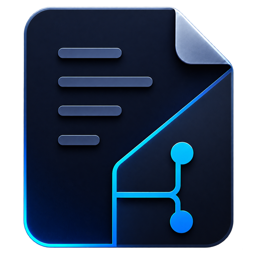
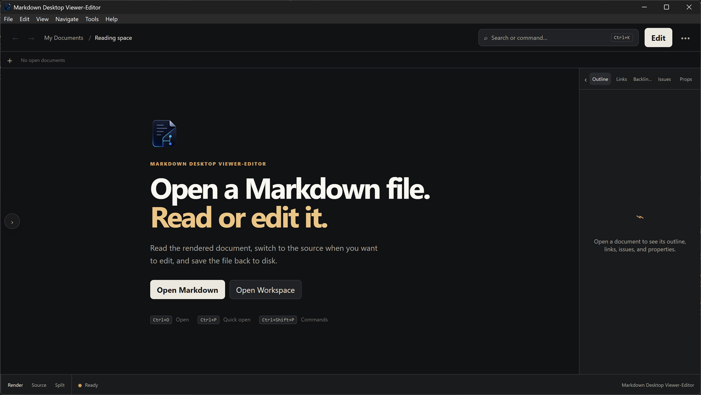
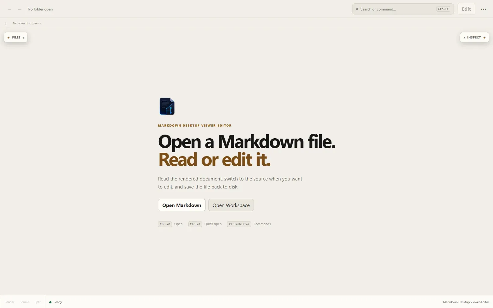
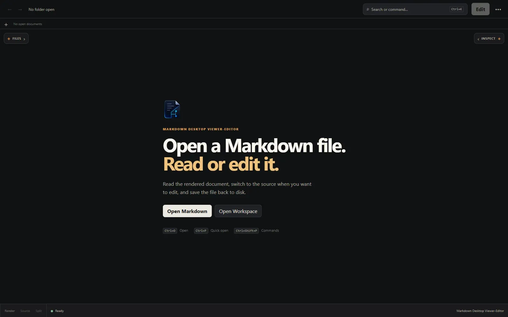

#  Markdown Desktop

A focused desktop viewer and editor for ordinary Markdown files.

<p align="center">
  <a href="https://github.com/ImYourBoyRoy/markdown-desktop/actions/workflows/ci.yml"></a>
  <a href="https://github.com/ImYourBoyRoy/markdown-desktop/releases"></a>
  <a href="./LICENSE"></a>
</p>

<p align="center">
  <a href="https://github.com/ImYourBoyRoy/markdown-desktop/releases"></a>
  <a href="https://github.com/ImYourBoyRoy/markdown-desktop/releases"></a>
  <a href="https://github.com/ImYourBoyRoy/markdown-desktop/releases"></a>
</p>

<p align="center">
  <a href="https://github.com/ImYourBoyRoy/markdown-desktop/releases">Download</a>
  ·
  <a href="https://github.com/ImYourBoyRoy/markdown-desktop/issues">Issues</a>
  ·
  <a href="./LICENSE">MIT license</a>
</p>

Open a file or folder, read the rendered document, switch to source when you need to edit, and save back to the same path on disk. There is no proprietary library, sync service, or document conversion step — the Markdown you already keep is the source of truth.

<p align="center">
  
</p>

## Features

- **Rendered, Source, and Split** views, with rendered reading as the default
- Workspace file tree, full-text search, tabs, outline, and link/issue panels
- Atomic saves that keep the file’s encoding, BOM, line endings, and final newline
- Recovery snapshots and conflict handling when a file changes outside the app
- Sanitized Markdown rendering with constrained local and remote assets
- Native menus, file associations, keyboard shortcuts, and light/dark themes

<table>
  <tr>
    <td align="center"><strong>Light</strong><br /></td>
    <td align="center"><strong>Dark</strong><br /></td>
  </tr>
</table>

<p align="center">
  
</p>

## Download

Installers and portable builds are on the [Releases](https://github.com/ImYourBoyRoy/markdown-desktop/releases) page. Every downloadable build follows the same pattern: `Markdown-Desktop-<version>-<platform>-<architecture>...`.

The checked-in release workflow targets all six platform families in the table below. Availability is release-specific: the published `v1.0.0` release predates the ARM64 and Apple notarization gates; the next intended release is `v1.0.1`, and it must not be announced until its complete asset list and `latest.json` have been verified. CI preparation run `32545608162` passed native packaging checks for all six architecture families and Windows NSIS/MSI install/uninstall smoke; remote Linux DEB install/purge and unsigned macOS Intel DMG copy/remove also pass. This does not substitute for published asset/signature metadata, Apple signing/notarization, Gatekeeper, desktop-session integration, or live updater evidence.

| Platform | Installer | Other packages |
| --- | --- | --- |
| Windows x64 | `Markdown-Desktop-<version>-Windows-x64-setup.exe` | `...-Windows-x64.msi`, `...-Windows-x64-Portable.exe` |
| Windows ARM64 | `Markdown-Desktop-<version>-Windows-ARM64-setup.exe` | `...-Windows-ARM64.msi`, `...-Windows-ARM64-Portable.exe` |
| macOS Apple Silicon | `...-macOS-Apple-Silicon.dmg` | `...-macOS-Apple-Silicon.app.tar.gz` |
| macOS Intel | `...-macOS-Intel.dmg` | `...-macOS-Intel.app.tar.gz` |
| Linux x64 | `...-Linux-x64.AppImage` | `...-Linux-x64.deb`, `...-Linux-x64.rpm` |
| Linux ARM64 | `...-Linux-ARM64.AppImage` | `...-Linux-ARM64.deb`, `...-Linux-ARM64.rpm` |

Files ending in `.sig` are signed companions used to verify updates on a signed release. `latest.json` is the machine-readable manifest used by the in-app updater; users normally do not download it. GitHub adds the two `Source code` archives automatically for anyone who wants the tagged source tree.

## Install

### Windows

Run the x64 or ARM64 `-setup.exe` that matches your Windows device, or use the matching `.msi` when your environment expects Windows Installer. The NSIS installer embeds the WebView2 bootstrapper for machines that need it. The installed app is registered as **Markdown Desktop**, adds a Start menu entry, and can be launched from Windows Search. The matching `-Portable.exe` runs without installing an uninstaller or Start menu entry.

### macOS

Open a signed and notarized `.dmg` from a verified release, then drag **Markdown Desktop** into Applications. macOS then exposes it through Finder and Launchpad like any other installed app. The current remote VM packaging evidence is unsigned and is for maintainer verification only.

### Linux

```bash
chmod +x ./Markdown-Desktop-*-Linux-x64.AppImage
./Markdown-Desktop-*-Linux-x64.AppImage
# ARM64 users: use the matching *-Linux-ARM64.AppImage name instead. AppImage is portable; use the `.deb` or `.rpm` package below when you want the app registered in the desktop application menu.
```

Or install the `.deb` / `.rpm` with your package manager:

```bash
sudo apt install ./Markdown-Desktop-*-Linux-x64.deb
# or
sudo dnf install ./Markdown-Desktop-*-Linux-x64.rpm
# ARM64 users: use the matching *-Linux-ARM64.deb or *-Linux-ARM64.rpm name instead.
```

## Uninstall

Uninstall removes the application and, with the steps below, its settings, recovery data, search index, logs, and webview cache. Your Markdown files are not deleted.

**Windows:** Settings → Apps → Markdown Desktop → Uninstall. The installers also clear `%APPDATA%\com.markdownnative.desktop` and `%LOCALAPPDATA%\com.markdownnative.desktop`.

**macOS:**

```bash
rm -rf -- \
  "/Applications/Markdown Desktop.app" \
  "$HOME/Library/Application Support/com.markdownnative.desktop" \
  "$HOME/Library/Caches/com.markdownnative.desktop" \
  "$HOME/Library/Logs/com.markdownnative.desktop" \
  "$HOME/Library/Preferences/com.markdownnative.desktop"
```

**Linux:**

```bash
sudo apt remove markdown-desktop   # or: sudo dnf remove markdown-desktop
rm -rf -- \
  "$HOME/.config/com.markdownnative.desktop" \
  "$HOME/.local/share/com.markdownnative.desktop" \
  "$HOME/.local/state/com.markdownnative.desktop" \
  "$HOME/.cache/com.markdownnative.desktop"
```

## Development

Requires Node.js 26.x, pnpm 11, Rust stable, and the [Tauri platform prerequisites](https://v2.tauri.app/start/prerequisites/).

```bash
pnpm install --frozen-lockfile
pnpm tauri dev
```

```bash
pnpm check
pnpm test
pnpm verify:dependencies
pnpm tauri build
```

`pnpm build:app` stages unsigned portable and installable outputs under `Apps/`. Signed release builds need `TAURI_SIGNING_PRIVATE_KEY` (or `TAURI_SIGNING_PRIVATE_KEY_PATH`) and `pnpm build:release`.

## Privacy and updates

Documents stay on your machine. The app does not upload file contents. Rendered Markdown is sanitized, and filesystem and remote asset access are restricted in the Rust host.

**Help → Check for Updates** (or **About**) checks a signed update manifest from GitHub Releases. A quiet check may run after launch to notify you in the status bar; updates are never downloaded or installed until you confirm. The signing private key is a maintainer secret and is not stored in this repository.

Upstream dependency advisories that remain in the stable Tauri Linux stack are documented in [SECURITY.md](./SECURITY.md).

## License

MIT. See [LICENSE](./LICENSE).
