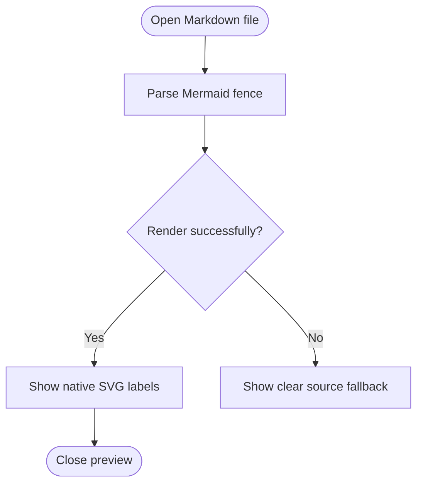

# Mermaid visual verification

This fixture exercises a real Mermaid fence with labels, branches, and a
previewable rendered diagram.

The expected result is a readable flowchart with visible labels and no blank
node boxes or HTML foreign-object labels.
